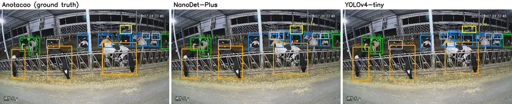

# Uso de dispositivos compactos para detecção comportamental de bovinos

*Use of compact devices for behavioral detection of cattle*

Repositório do Trabalho de Conclusão de Curso de **Arnold Zago dos Reis**, apresentado ao curso de Bacharelado em Engenharia de Software da **Universidade Tecnológica Federal do Paraná (UTFPR), Câmpus Dois Vizinhos**, sob orientação do **Prof. Dr. Marlon Marcon**. Aprovado em 30 de junho de 2025.

📄 **[Texto completo do TCC (PDF)](docs/TCC_Arnold_Zago_dos_Reis.pdf)**

## Sobre o trabalho

O trabalho avalia se **Single Board Computers (SBCs)**, computadores compactos e de baixo custo, conseguem executar modelos de detecção de objetos para monitorar automaticamente o comportamento de bovinos confinados. Foram comparados quatro detectores (**YOLOv4-tiny, YOLOv7-tiny, NanoDet e DETR**) em quatro dispositivos (**Raspberry Pi Zero, Banana Pi M2 Zero, Raspberry Pi 3 e NVIDIA Jetson Nano**). A avaliação considerou o tempo de processamento, a estabilidade operacional (CPU e memória) e a precisão na detecção de sete comportamentos: *bebendo, comendo, deitado, em pé, escondido, pastando* e *outro*.



## Principais resultados

### Tempo médio por imagem nos SBCs (segundos)

| Modelo | Banana Pi M2 Zero | Raspberry Pi 3 | Jetson Nano |
|---|---:|---:|---:|
| YOLOv4-tiny | 21,59 | 24,50 | 5,86 |
| YOLOv7-tiny | 21,60 | 20,65 | 6,69 |
| **NanoDet** | **4,00** | **4,80** | **1,44** |
| DETR | – | – | 1,45 |

O Raspberry Pi Zero não conseguiu nem concluir a instalação das dependências, e o DETR só rodou no Jetson Nano. O consumo de CPU e memória de cada combinação está em [`sbc/`](sbc/).

### Precisão na detecção de comportamento

| Métrica | YOLOv4-tiny | YOLOv7-tiny | NanoDet | DETR |
|---|---:|---:|---:|---:|
| Precision | **0,96** | 0,91 | 0,76 | 0,94 |
| Recall | **0,92** | 0,69 | 0,68 | 0,69 |
| F1-Score | **0,94** | 0,78 | 0,72 | 0,79 |

### Conclusões

- O **YOLOv4-tiny** foi o modelo mais equilibrado em precisão (F1-Score de 0,94). No **Jetson Nano**, é a melhor opção quando se precisa de alta precisão (5,86 s por imagem).
- O **NanoDet** foi o mais rápido em todos os dispositivos. No **Banana Pi M2 Zero**, é a opção mais eficiente para hardware limitado: 4 s por imagem e 0,22% de memória RAM.
- O **Jetson Nano** foi o único dispositivo capaz de executar todos os modelos, incluindo o DETR.
- SBCs de baixo custo são viáveis para o monitoramento comportamental de bovinos, com limitações de hardware e de periféricos.

Métricas por classe e uma reavaliação complementar com métricas COCO estão em [`resultados/`](resultados/).

## Conteúdo do repositório

```
├── docs/           texto completo do TCC (PDF)
├── sbc/            dispositivos testados, configuração e resultados de desempenho
├── darknet/        configurações do YOLOv4-tiny e YOLOv7-tiny
├── nanodet/        configuração, script de treino e logs do NanoDet
├── detr/           informações do DETR
├── dataset/        datasets utilizados e distribuição das classes
├── notebooks/      notebooks de treino (Colab / Kaggle)
├── resultados/     métricas, gráficos e exemplos
└── scripts/        inferência, avaliação e utilitários
```

## Pesos treinados

Os pesos ficam na página de **[Releases](../../releases)**:

| Arquivo | Modelo |
|---|---|
| `yolov4-tiny-custom_best.weights` | YOLOv4-tiny |
| `yolov7-tiny-custom_30000.weights` | YOLOv7-tiny |
| `nanodet_model_best.pth` | NanoDet (PyTorch) |
...

## Como usar

```bash
git clone https://github.com/SEU_USUARIO/deteccao-comportamental-bovinos-sbc.git
cd deteccao-comportamental-bovinos-sbc
pip install -r requirements.txt
cd scripts
```

Baixe os pesos da Release e rode:

```bash
# NanoDet (ONNX): leve, não precisa de PyTorch, bom para SBCs
python inferencia_nanodet_onnx.py --modelo nanodet_comportamento_gado-sim.onnx --imagem foto.jpg

# YOLOv4-tiny via OpenCV: não precisa compilar o Darknet
python inferencia_yolo_opencv.py --cfg ../darknet/yolov4-tiny-custom.cfg \
    --pesos yolov4-tiny-custom_best.weights --imagem foto.jpg
```

## Datasets

- **Comportamento de gado v6** ([Roboflow Universe](https://universe.roboflow.com/aplicao-de-tcnicas-de-viso-computacional-para-anlise-comportamental-de-animais-em-confinamento/comportamento-de-gado-axlhv), CC BY 4.0), criado por Freitas (2024). Usado no treino e na avaliação de precisão.
- **Cattle Detection** ([Roboflow Universe, loliktry](https://universe.roboflow.com/loliktry/cattle_detection-060yo/dataset/1)), com 115 imagens. Usado nos testes de desempenho nos SBCs.

Detalhes em [`dataset/`](dataset/).

## Citação

```bibtex
@misc{zagodosreis2025bovinos,
  author = {Arnold Zago dos Reis},
  title  = {Uso de dispositivos compactos para detecção comportamental de bovinos},
  year   = {2025},
  note   = {Trabalho de Conclusão de Curso (Bacharelado em Engenharia de Software), Universidade Tecnológica Federal do Paraná, Câmpus Dois Vizinhos. Orientador: Marlon Marcon},
  url    = {https://github.com/SEU_USUARIO/deteccao-comportamental-bovinos-sbc}
}
```

## Agradecimentos

Ao orientador Prof. Dr. Marlon Marcon, aos membros da banca, Prof. Dr. André Roberto Ortoncelli e Prof. Dr. Evandro Miguel Kuszera, e a Freitas (2024), cujo trabalho e dataset serviram de base para esta pesquisa.

## Licença

- **Código:** [MIT](LICENSE)
- **Texto do TCC** (`docs/`): [CC BY-NC 4.0](https://creativecommons.org/licenses/by-nc/4.0/deed.pt_BR)
- **Datasets:** seguem as licenças definidas por seus autores no Roboflow
- **Modelos base:** Darknet (domínio público), NanoDet, DETR e RF-DETR (Apache-2.0)
