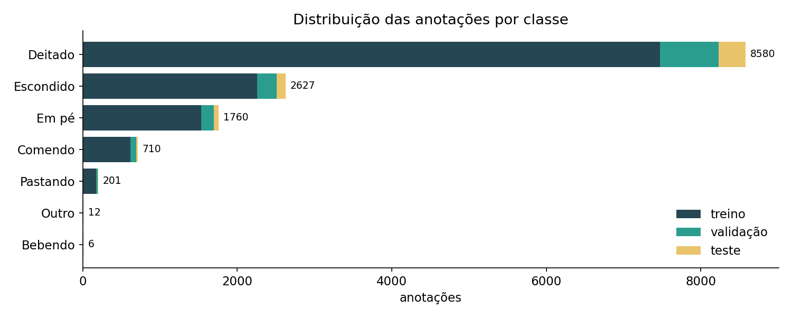

# Datasets

O TCC usou dois datasets públicos do Roboflow Universe:

| Uso | Dataset | Imagens |
|---|---|---|
| Tempo por imagem e consumo de recursos nos SBCs | [Cattle Detection (loliktry, 2023)](https://universe.roboflow.com/loliktry/cattle_detection-060yo/dataset/1) | 115 |
| Treino e precisão na detecção de comportamento | [Comportamento de gado v6](https://universe.roboflow.com/aplicao-de-tcnicas-de-viso-computacional-para-anlise-comportamental-de-animais-em-confinamento/comportamento-de-gado-axlhv) | veja abaixo |

## Comportamento de gado

Dataset criado no trabalho de [Freitas (2024)](#referência), *Aplicação de técnicas de visão computacional para análise comportamental de animais em confinamento* (dissertação de mestrado, UTFPR), no qual este TCC se baseia.

- **Fonte:** [Roboflow Universe — Comportamento de gado (v6)](https://universe.roboflow.com/aplicao-de-tcnicas-de-viso-computacional-para-anlise-comportamental-de-animais-em-confinamento/comportamento-de-gado-axlhv)
- **Licença:** [CC BY 4.0](https://creativecommons.org/licenses/by/4.0/)
- **Imagens na versão exportada usada nos treinos:** 1.077 (945 treino · 89 validação · 43 teste), redimensionadas para 640×640
- **Aumento de dados** (apenas no treino): 3 versões de cada imagem, com flip horizontal (50%) e recorte aleatório de 0 a 20%
- **Formatos usados:** COCO (NanoDet, DETR, RF-DETR) e Darknet/YOLO (YOLOv4-tiny, YOLOv7-tiny)

As imagens não estão neste repositório. Baixe-as pelo link acima, no formato desejado.

## Classes e distribuição das anotações

| Classe | Treino | Validação | Teste |
|---|---:|---:|---:|
| Deitado | 7.471 | 757 | 352 |
| Escondido | 2.255 | 258 | 114 |
| Em pé | 1.532 | 165 | 63 |
| Comendo | 618 | 75 | 17 |
| Pastando | 175 | 20 | 6 |
| Outro | 12 | 0 | 0 |
| Bebendo | 6 | 0 | 0 |
| **Total** | **12.069** | **1.275** | **552** |

O dataset é bastante desbalanceado. As classes **Bebendo** e **Outro** têm pouquíssimos exemplos de treino e nenhum em validação ou teste, então não podem ser avaliadas e ficam fora das médias das métricas.

## Referência

FREITAS, V. d. A. *Aplicação de técnicas de visão computacional para análise comportamental de animais em confinamento*. Dissertação (Mestrado) — Universidade Tecnológica Federal do Paraná, 2024.
