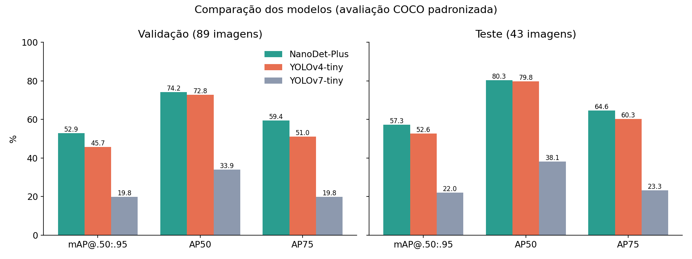
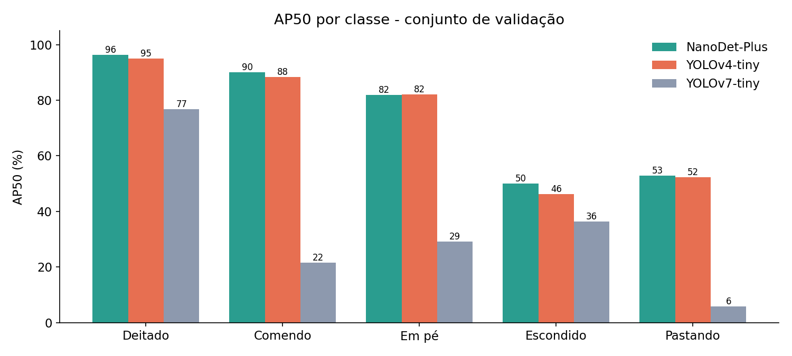
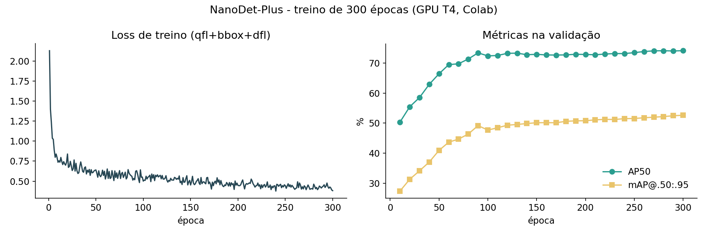
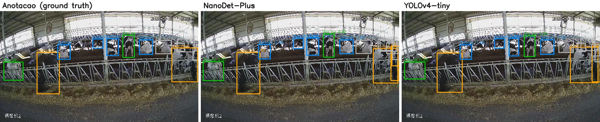

# Resultados

## Resultados do TCC

Métricas de precisão na detecção de comportamento, conforme as Tabelas 4 e 5 do [texto do TCC](../docs/TCC_Arnold_Zago_dos_Reis.pdf). Os resultados de tempo e consumo de recursos nos SBCs estão em [`../sbc/`](../sbc/).

### Métricas gerais (média das classes)

| Métrica | YOLOv4-tiny | YOLOv7-tiny | NanoDet | DETR |
|---|---:|---:|---:|---:|
| Precision | **0,96** | 0,91 | 0,76 | 0,94 |
| Recall | **0,92** | 0,69 | 0,68 | 0,69 |
| F1-Score | **0,94** | 0,78 | 0,72 | 0,79 |

### Métricas por classe (P = Precision, R = Recall, F1 = F1-Score)

| Classe | YOLOv4-tiny P / R / F1 | YOLOv7-tiny P / R / F1 | NanoDet P / R / F1 | DETR P / R / F1 |
|---|---|---|---|---|
| Bebendo | 1,000 / 0,92 / 0,958 | 1,000 / 0,69 / 0,817 | N/A | N/A |
| Comendo | 0,938 / 0,92 / 0,929 | 0,434 / 0,69 / 0,533 | 0,902 / 0,68 / 0,776 | 1,000 / 0,69 / 0,817 |
| Deitado | 0,983 / 0,92 / 0,951 | 0,974 / 0,69 / 0,808 | 0,967 / 0,68 / 0,798 | 0,990 / 0,69 / 0,812 |
| Em pé | 0,925 / 0,92 / 0,922 | 0,867 / 0,69 / 0,769 | 0,825 / 0,68 / 0,746 | 0,940 / 0,69 / 0,793 |
| Escondido | 0,889 / 0,92 / 0,904 | 0,734 / 0,69 / 0,711 | 0,526 / 0,68 / 0,593 | 0,850 / 0,69 / 0,763 |
| Pastando | 0,907 / 0,92 / 0,913 | 0,417 / 0,69 / 0,520 | 0,568 / 0,68 / 0,620 | 0,550 / 0,69 / 0,613 |
| Outro | 1,000 / 0,92 / 0,958 | N/A | N/A | N/A |

As classes Bebendo e Outro têm número insuficiente de anotações (veja [`../dataset/`](../dataset/)).

---

## Reavaliação complementar (setembro de 2026)

Depois do TCC, os modelos com pesos preservados foram reavaliados com métricas COCO (mAP), complementando as métricas de Precision/Recall/F1 do TCC. Estas métricas não substituem as do trabalho: medem outra coisa (qualidade do ranking de detecções em vários limiares de IoU) e usam outro avaliador.

### Metodologia

Todos os modelos foram avaliados **com o mesmo avaliador** (pycocotools, métricas COCO), usando `scripts/avaliar_coco.py`:

- **NanoDet-Plus:** modelo ONNX (`nanodet_comportamento_gado-sim.onnx`), entrada 320×320
- **YOLOv4-tiny / YOLOv7-tiny:** pesos Darknet carregados via OpenCV DNN, entrada 416×416

As classes sem instâncias no conjunto avaliado (Bebendo e Outro) são ignoradas pelo avaliador COCO. Os números completos estão em `metricas_coco.json`.

> Os resultados oficiais do trabalho são os da seção anterior.

### Comparação geral

| Modelo | Conjunto | mAP@.50:.95 | AP50 | AP75 | Tempo em CPU* |
|---|---|---:|---:|---:|---:|
| **NanoDet-Plus** | validação | **52,9%** | **74,2%** | **59,4%** | **~18 ms** |
| YOLOv4-tiny | validação | 45,7% | 72,8% | 51,0% | ~116 ms |
| YOLOv7-tiny | validação | 19,8% | 33,9% | 19,8% | ~206 ms |
| **NanoDet-Plus** | teste | **57,3%** | **80,3%** | **64,6%** | |
| YOLOv4-tiny | teste | 52,6% | 79,8% | 60,3% | |
| YOLOv7-tiny | teste | 22,0% | 38,1% | 23,3% | |

\* Tempo médio por imagem em 1 núcleo de CPU x86, incluindo pré e pós-processamento (onnxruntime / OpenCV DNN). Serve apenas para comparação relativa. Os tempos medidos nos SBCs estão em [`../sbc/`](../sbc/).

### AP50 por classe (validação)

| Classe | NanoDet-Plus | YOLOv4-tiny | YOLOv7-tiny |
|---|---:|---:|---:|
| Deitado | 96,4% | 95,0% | 76,8% |
| Comendo | 90,1% | 88,3% | 21,5% |
| Em pé | 81,9% | 82,1% | 29,1% |
| Pastando | 52,8% | 52,3% | 5,9% |
| Escondido | 50,0% | 46,2% | 36,3% |

### Treino do NanoDet-Plus

### Exemplos (conjunto de teste)

### Reavaliação nativa do Darknet (`darknet detector map`, mAP@0.50)

O Darknet calcula a média sobre as 7 classes, contando Bebendo e Outro como 0%. Por isso os valores abaixo são menores que os da tabela COCO. A coluna "5 classes" é a média apenas das classes presentes.

| Pesos | Iterações | Validação (7 classes) | Validação (5 classes) | Teste (5 classes) |
|---|---:|---:|---:|---:|
| yolov4-tiny `_best` | ~12.900 | **55,6%** | **77,9%** | **83,9%** |
| yolov4-tiny `_10000` | 10.000 | 55,1% | 77,1% | |
| yolov4-tiny `_last` | ~13.200 | 54,1% | 75,7% | |
| yolov7-tiny `_30000` | 30.000 | 29,5% | 41,2% | 45,6% |
| yolov7-tiny `_best` | ~36.000 | 26,2% | 36,6% | 36,9% |
| yolov7-tiny `_last` | ~36.100 | 23,3% | 32,7% | |

### Modelos não reavaliados

- **DETR:** consulte os resultados do TCC acima.
- **RF-DETR Base:** experimento adicional, não incluído no TCC.
